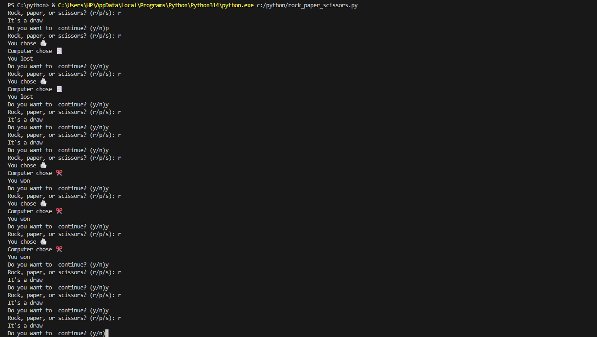

# ROCK_PAPER_SCISSORS

### DESCRIPTION

    This is a game that allows the computer to choose betweeen rock, paper, scissors and give the user the same choice and then deicides who won based on what they chose.

### Steps taken to develop the project

1. First step is to import random
2. Then we define a function to choose randomly between between rock,paper,scissors.
3. Next step is to create a dictionary to hold rock paper and scissors with a key value.
4. Then we create a loop to help the user but whatever he chooses between the three before comparing the user value to the one the computer chooses.
5. Then we list out conditions where the user wins and also conditions where the users looses.
6. In the loop we will also keep on asking if they want to keep playing to continue the process if not the loop should be broken.

## OUTCOME EXECUTION

